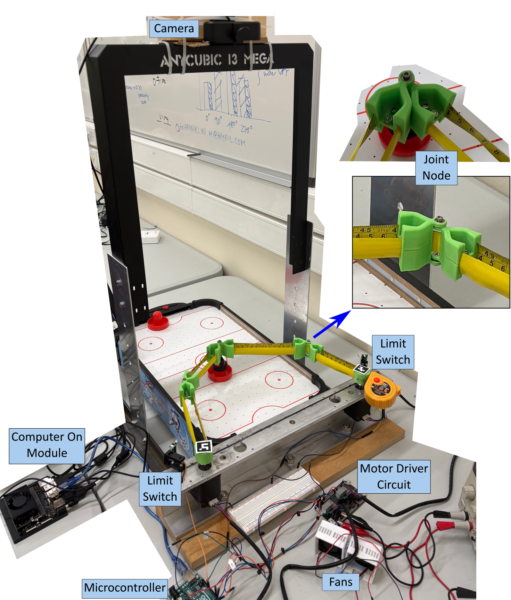
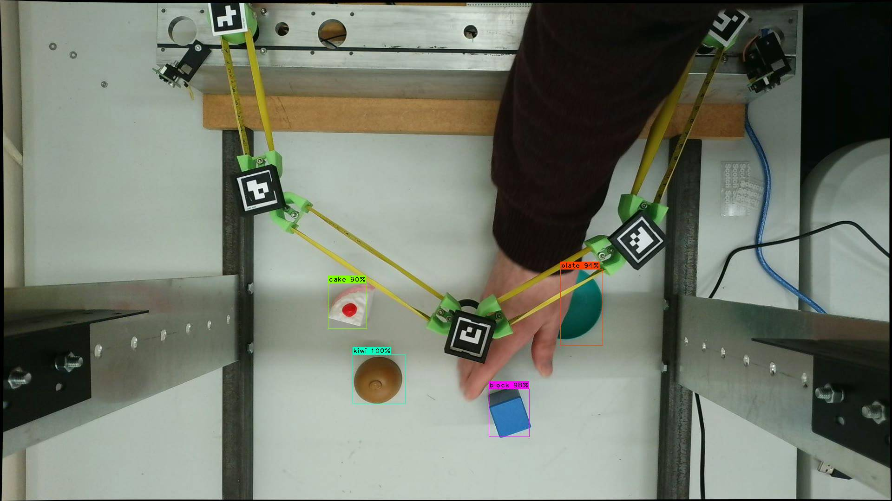
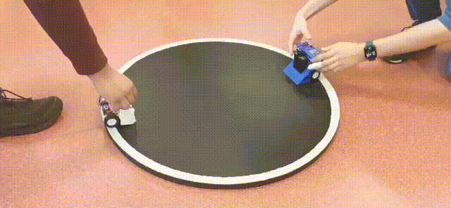

# Project Showcase

Details from a selection of projects I've worked on recently. I'm not able to publicly publish details on all the projects mentioned on my CV, but will often be able to provide further details in-person.

## Master's Thesis
*C, C++, Python, electronics, motors, embedded Linux, Machine Learning, YOLO Convolutional Neural Networks, multithreading, computer vision, Nvidia Jetson, Arduino HAL, Pi Pico C SDK, CMake, Git*

I designed and built an autonomous control system for an unusual type of robotic arm [further details](origamiArm_thesis).

  
  

## PCB Design for Aerospace Society Robot Arm
*PCB design, electronics, motors, KiCAD, AVR toolchain & header files (ATTiny1616), Pi Pico C SDK, CMake, Git*

I designed a PCB (and started developing firmware before the project was paused) for controlling a more standard type of robotic arm [further details](/aerospaceSoc_arm).

  
  

## Student Records System Group Project (C++)
*C++ (inc. templates, polymorphism), Git*

Wrote a student records system in C++ working in a group with two other students. My key contributions included [RecordArray.h](https://github.com/dgc-proton/student_records/blob/f9036c25a1f91dfeeb8e31d3ee705a33cd7d0d76/RecordArray.h) and [RecordLinkedList.h](https://github.com/dgc-proton/student_records/blob/f9036c25a1f91dfeeb8e31d3ee705a33cd7d0d76/RecordLinkedList.h). I also played a key role in architecture such as use of the attorney-client idiom to control access to implementation details of classes, making use of class templates and polymorphism, and using Clang sanitisers to analyse the program for issues.

## Machine Learning for Earthquake Detection
*Python, Machine Learning, big data, Git*

I worked with a geophysics researcher on [PICTS](https://amygilligan.wordpress.com/research/picts/). This included recovery of seismometers and processing of their data. I wrote a [Python package](https://github.com/dgc-proton/PICTS_ML) which makes re-training machine learning models for earthquake detection in Scotland (or other areas with limited specific data available for them) more efficient. I also worked with another student and the researcher to produce a [poster](https://github.com/dgc-proton/PICTS_ML/blob/23283c13866cba830c897255cf755134cbcb0d57/PGRiP_Poster_PICTS.pdf) summarising the research, which I presented at the British Geophysics Association Postgraduate Research in Progress conference. 

## Some Other Projects

Some of my other recent projects have included:

### University Robotics League Competitions

Competition: In teams of two people, construct self-balancing robots from cheap kits intended to build a basic car robot, plus an IMU and 3D printed parts. Robots must self-balance autonomously with all processing done on the onboard MCU, but can be sent steering commands by IR remote. They competed in various events: balancing for time, hill climbing (with and without added weight), and a code quality review.
Result: 2nd place.
Robot:

Competition: In teams of three people, construct small (under a specified size and weight) fully autonomous sumo wrestling robots with all processing done on the onboard MCU. The robots compete against each other in a sumo wrestling tournament.
Result: 2nd place.
Robot (the shorter white one):

### Electronics Design - DC Motor Control
*C++, motors, PID control*

Designed a controller for a DC motor with a Hall effect encoder, using an object-oriented approach in C++. Inputs for forward/reverse and on/off were taken from push buttons (with software debouncing), and speed was taken from a potentiometer. Interrupts were used to monitor the hall effect sensor and calculate speed. Different control strategies were used including PID tuned 'by eye' and using the Ziegler-Nichols Method. A strategy to control the position of the shaft (rather than its speed) was also developed. [Link to code.](DC_motor_control).

### Communications Engineering
*communications protocols, oscilloscope use*
 
Carried out a series of assessed practical lab activities constructing control busses and analysing messages sent across them using an oscilloscope. Wrote a technical note for each covering the line driver chips used, message decoding, and checking measurements of the waveform against the formal specification for the communication standard. Protocols covered in this manor included EIA-232, EIA-485 and DMX (inc RDM), with other assessments carried out that covered CAN, USART use, GPS NMEA, various integrity checks and checksums. The course, combined with a digital systems course, also look at other standards including i2c and SPI.  

### Signals & Systems
*DSP, Python, filter design*

Digitally remastering a noisy audio clip using Python. The final version used a combination of a custom designed IIR notch filter and a Fast Fourier Transform method to improve the Signal to Noise Ratio from 11.66 DB to 30.68 dB, and then simulated playing it over a set of high-end speakers with a custom-designed crossover.

