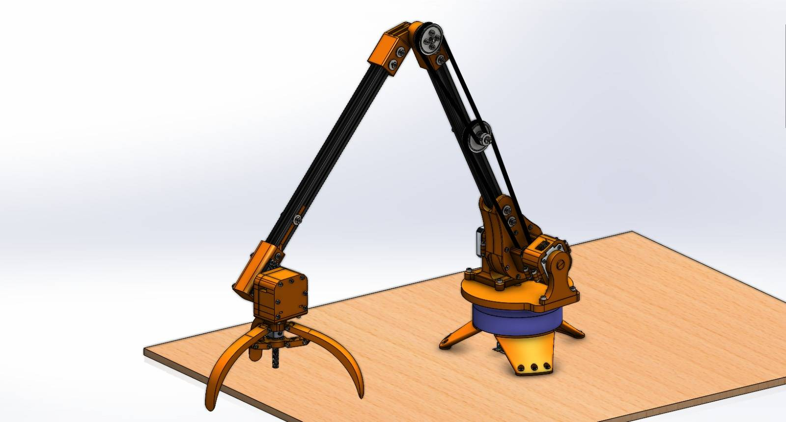
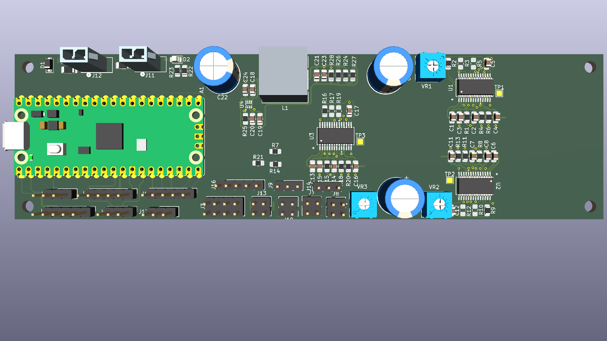
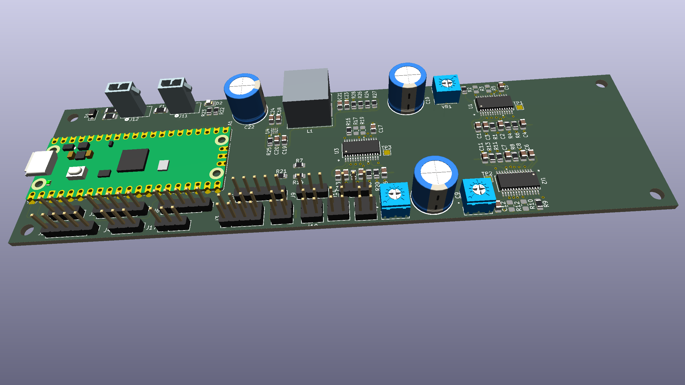

The Aberdeen University Aerospace Society decided to start a side project to create a robot arm. The arm project is currently on hold while the society focus time and funding on remediating issues discovered on the main UAV project; the files here show the current state of the design.

Mechanical design was done by Ben Pickering, electronics, PCB design and firmware by Dave Riley. 

3D CAD rendering of the arm:

Note that the design was updated to replace the ATTiny1616 MCU with a Pi Pico development board. This was done because because a potential future contributor wanted experience with the RP2040/2350, and hand soldering these MCUs appeared very challenging.

[PCB schematic](RobotArmPCB_schematic_v0.2_DRAFT.pdf)

3D views of the PCB (board will be resized based on final design of mounting points in controller enclosure):

