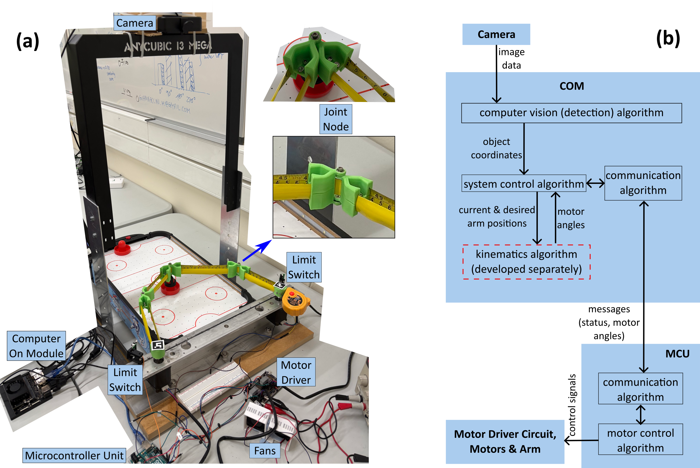

# Thesis - Autonomous Origami Arm

For my Master's thesis I designed and built the control system for potentially novel type of 5-bar origami-inspired robotic arm, where the arm was formed from one continuous tape spring with 'joints' formed by nodes that pinched the tape together, and the overall arm positioned by moving two motors.

The system was able to autonomously track multiple objects and move the arm to accomplish simple tasks in real time while running in a resource constrained environment.

This version of the motor controller MCU used C++ and the Arduino HAL so code was portable between several different boards and could be more easily modified by future researchers at the university [link to code](motorController/motorController.ino).

The system controller (running on the Jetson) was primarily written in Python, with multithreading used. It calls a shared library for the kinematics (written in C so it's more performant), and interfaces with the darknet C++ framework for running the YOLO CNN to detect objects in camera frames [link to the code](systemController/src/systemcontroller). Code structure:

- **api** - interfaces
- **cnn_files** - files required to set up the custom trained CNN, with the code to do the setup in core/yolo.py
- **core** - all core functions
- **utils** - non-core functions
- *cam_cal.npz* - calibration data used to undistort camera frames
- *config.toml* - end-user configuration file to change behaviours and pass system setup parameters
- *main.py* - entry point that carries out initial setup, then launches the desired behaviour

System behaviour:
[System behaviour diagram.](system_control_flow.drawio.png)

My [poster](Poster.pdf) summarises the project and key results.

The MEng thesis / individual project report at Aberdeen is capped at 15 pages for the main paper. My main paper is available [here](thesis_main_paper.pdf). It goes into more detail on the accuracy achieved, economic viability, challenges such as joint tension and motor resonance, and identifies pathways to further improve the prototype. 
